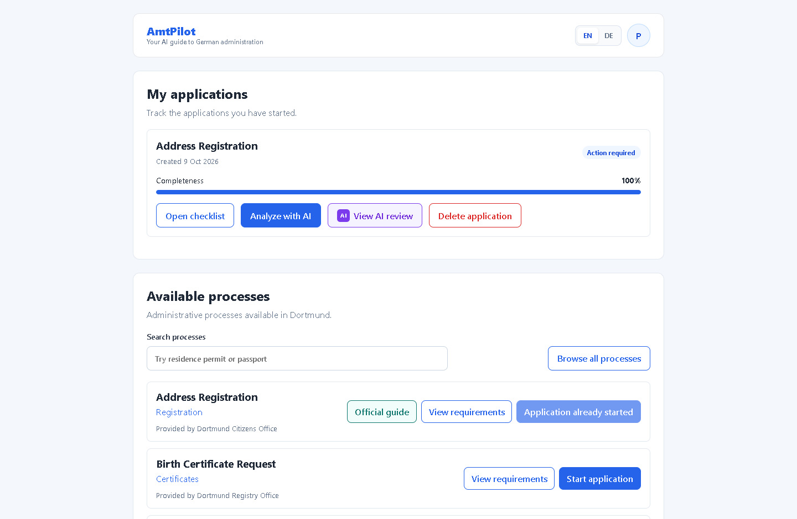
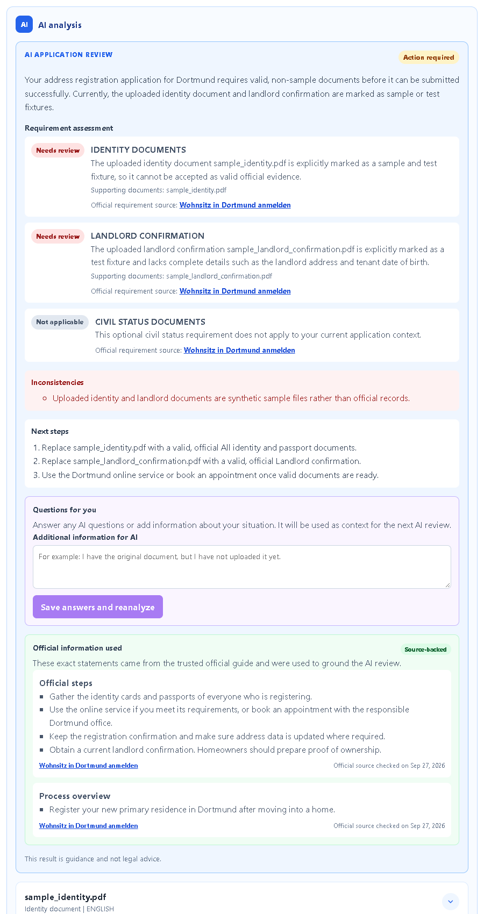
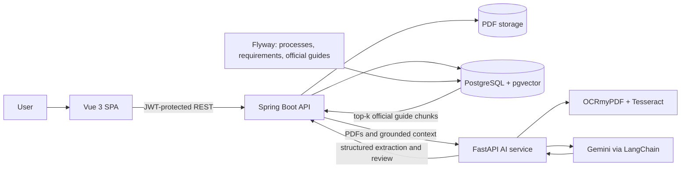

# AmtPilot

[](https://github.com/saeed-mh/amt-pilot/actions/workflows/ci.yml)

AmtPilot is an AI-assisted full-stack application that helps people understand German administrative processes, prepare the right documents, and identify what to do next. Dortmund address registration is the first end-to-end, source-grounded use case.

> Portfolio and educational project. AmtPilot provides guidance, not legal advice.

## What it demonstrates

- Secure registration, JWT authentication, and user-owned application data
- Searchable administrative-process catalog with official sources
- Application tracking, document checklists, and automatic completeness updates
- Validated PDF upload, preview, download, and deletion
- Native PDF extraction plus local German/English OCR for scanned pages
- Structured Gemini document analysis with evidence, warnings, and missing fields
- Retrieval-augmented generation (RAG) over trusted official guidance using Gemini embeddings and PostgreSQL `pgvector`
- Source-backed application reviews with requirement status, inconsistencies, practical next steps, and user clarification
- Deterministic safeguards for critical document distinctions and unsafe AI classifications
- English/German Vue interface with responsive application and process views

## Screenshots

### Application dashboard



### Grounded AI review



## Architecture



### AI and RAG flow

1. Flyway loads reviewed process guidance and official-source metadata.
2. Spring Boot chunks the guide, requests Gemini embeddings, and stores the vectors in PostgreSQL.
3. A user uploads PDFs. The AI service extracts native text or applies local OCR when needed.
4. Spring Boot retrieves the most relevant official chunks for the application context.
5. Gemini receives the extracted document information, requirements, user context, and only the retrieved guide context.
6. Pydantic and Java DTOs enforce a structured response; deterministic rules correct important unsafe classifications.
7. The UI presents evidence, missing items, next steps, and links back to the official source.

## Technology choices

| Area | Choice | Why |
| --- | --- | --- |
| Core API | Java 21, Spring Boot, Spring Security, JPA | Typed domain logic, mature security, and testable service boundaries |
| AI service | Python 3.11, FastAPI, LangChain, Pydantic | Keeps AI/OCR concerns isolated and validates model output structurally |
| Models | Google Gemini | Structured document reasoning and embeddings through one provider |
| Retrieval | PostgreSQL, pgvector | Semantic search without adding a separate vector database |
| Frontend | Vue 3, Vue Router, Vite | Small, approachable SPA with a fast development workflow |
| Data | Flyway migrations | Reproducible schema, catalog data, requirements, and official guides |
| OCR | OCRmyPDF, Tesseract | Local preprocessing for scanned German and English PDFs |
| Quality | JUnit, Mockito, Testcontainers, Pytest, Ruff, ESLint | Unit, controller, integration, AI-contract, and frontend checks |

## Quality and evaluation

GitHub Actions verifies the backend, AI service, and frontend on every pull request and push to `main`.

- **Backend:** unit, controller, security, repository, migration, and PostgreSQL integration tests
- **AI service:** extraction, OCR fallback, embeddings, advice, API contract, and safety-rule tests
- **AI evaluations:** versioned synthetic cases score requirement accuracy, readiness, grounding, guidance, and unsafe approvals
- **Frontend:** ESLint/Oxlint checks and a production Vite build

Run the live evaluation separately because it calls Gemini and uses API quota:

```bash
cd ai-service
python -m evals.run --fail-below 0.90
```

See [the evaluation design](ai-service/evals/README.md) for the dataset and scoring rules.

## Run locally

### Requirements

- Java 21 or newer
- Docker Desktop
- Python 3.11 or newer
- Node.js `^22.18.0` or `>=24.12.0`
- Tesseract 5 with German and English language data
- A Google AI API key

Copy `.env.example` to `.env`, then set at least:

```env
JWT_SECRET=replace-with-a-random-secret-at-least-32-characters
GOOGLE_API_KEY=replace-with-your-google-ai-api-key
```

Install the frontend and AI-service dependencies once:

```bash
cd frontend && npm install
cd ../ai-service
python -m venv .venv
# Activate .venv, then:
python -m pip install -e ".[dev]"
cd ..
```

Start PostgreSQL, Spring Boot, FastAPI, and Vue together:

```bash
bash start-dev.sh
```

Press `Ctrl+C` to stop the complete stack. Development logs are written to the ignored `.dev-logs/` directory.

| Service | URL |
| --- | --- |
| Frontend | <http://localhost:5173/> |
| Backend Swagger UI | <http://localhost:8080/swagger-ui.html> |
| Backend health | <http://localhost:8080/actuator/health> |
| AI Swagger UI | <http://localhost:8000/docs> |
| AI health | <http://localhost:8000/health> |

### Run checks manually

```bash
# Backend
./mvnw verify

# Frontend
cd frontend
npm run lint
npm run build

# AI service
cd ../ai-service
pytest
ruff check app tests evals
```

## Privacy and AI limitations

- Do not upload passports, residence documents, or other real personal data to a public portfolio deployment. Use synthetic or properly redacted files.
- When analysis is requested, extracted document text and grounded context are sent to the configured Gemini service.
- Uploaded PDFs are stored by the Spring Boot service; the current project is not presented as a production-compliant document vault.
- AI and OCR can be wrong. Results must be verified against the linked official source.
- The first fully grounded guide covers Dortmund address registration; other catalog entries do not yet have the same RAG coverage.
- The application does not determine document authenticity and does not submit applications to an authority.

Read the full [privacy and AI limitations](docs/privacy-and-ai-limitations.md) before deploying the project publicly. Security issues should be reported as described in [SECURITY.md](SECURITY.md).

## Project status

The local end-to-end workflow is implemented: users can select a process, manage documents, run grounded AI analysis, provide clarification, and receive cited next steps. The next deployment milestone is a privacy-safe public demo restricted to synthetic data.
